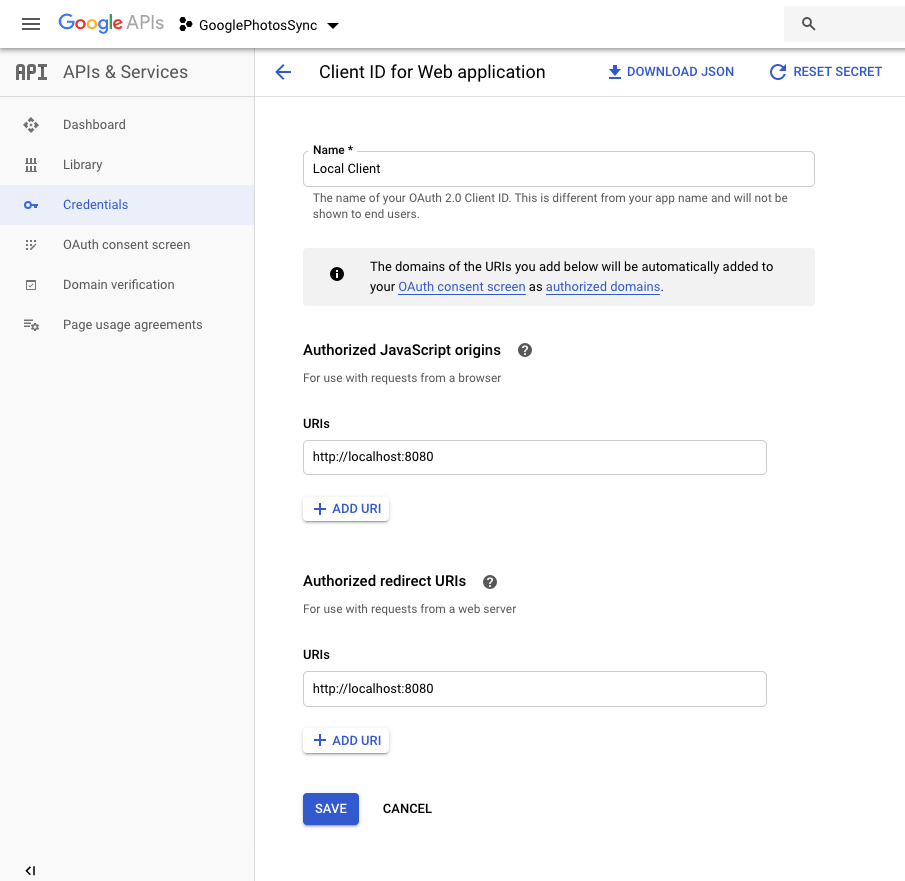

# Google Photos Sync
GPSync is an application that categorizes your offline files to folders corresponding to your Google Photos albums. I use this application for an offline backup of my photos from multiple phones and cameras.
1. I use Google Photos to sync my photos to the cloud.
2. I create albums in Google Photos.
3. I download all original files (from our phones, cameras etc.) to my computer - all to the same folder.
4. I run GPSync. It walks through Google Photos and creates a folder for each album. Then it moves corresponding files from my disk to that appropriate folder. All files that are not part of a Google Photos album are categorized by month they were created.
5. When finished I store all original files on my NAS or an attached hard drive for archival purposes (in case Google stops supporting photos at some point in the future). 

## Setup
Register your application in the [Google API Console](https://console.developers.google.com/apis/dashboard?project=glossy-box-259221&pli=1) and generate credentials for a Web Application (set authorized redirect URIs to http://localhost:8080 - or change accordingly if your SpringBoot apps are running elsewhere).
.

Download [client_id.json](src/main/resources/client_id_sample.json) file with your credentials and save it to the [src/main/resources/](src/main/resources/) folder.

Edit [application.properties](src/main/resources/application.properties) and set appropriate configuration:
* **filesystem.sourceFolder** Folder where you are downloading your photos.
* **filesystem.targetFolder** Folder where GPSync will create albums and move photos from the source folder to them. 
* **filesystem.stopAfterNEmptyAlbums** Number of empty albums that cause the sync to stop. GPSync will retrieve albums from Google Photos from the newest one. It walks through them and counts how many albums did not have any corresponding files on the disk. If a threshold set by this value is reached, it stops walking through the albums.

Run
```bash
mvn spring-boot:run
```

Go to http://localhost:8080/. Give the application the right to read your Google Photos profile. Watch logs.

## For Developers

* An example of Google OAuth flow initiation can be found in [GoogleAuthService](src/main/java/com/ivolasek/gpsync/google/GoogleAuthService.java).
* Google Photos can be used through [PhotosService](src/main/java/com/ivolasek/gpsync/google/PhotosService.java).

## Copying files
If you want to merge two folders (one that you created earlier with same folder filled in later) there is a hidden option on Mac:
[How to combine folders in macOS using the hidden Merge options and the Ditto command](https://appleinsider.com/articles/18/03/02/how-to-combine-folders-in-macos-using-the-hidden-merge-options-and-the-ditto-command)

TL;DR Move the files while holding the ```Option``` key.

## Copying to s3
```bash
aws s3 cp ~/Downloads/photos_target/ s3://laskovi-photos/2023 --recursive
```

## Related Reading

### Photos API 
https://developers.google.com/photos/library/reference/rest/v1/mediaItems/search

### Google OAuth2 Library
https://developers.google.com/api-client-library/java/google-api-java-client/oauth2

https://developers.google.com/api-client-library/java/google-api-java-client/oauth2#authorization_code_flow

### Google Photos API Java client 
https://developers.google.com/photos/library/guides/get-started-java

https://developers.google.com/photos/library/guides/authentication-authorization
